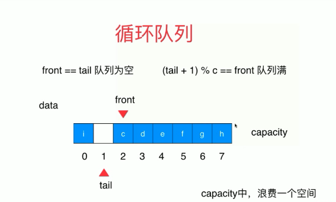

- 队列也是一种线性结构
- 相比数组，队列对应的操作是数组的子集
- 只能从一端（队尾）添加元素，只能从另一端（队首）取出元素
- 队列是一种先进先出的数据结构
    - First In First Out(FIFO)
 
 ### 数组队列
 - 出队操作的计算复杂度为O(n)
    - 每次出队后，后面的操作都要往前移动一位
 
 ### 循环队列
 - front == tail 队列为空
 - (tail + 1)&c = front 队列满
 

