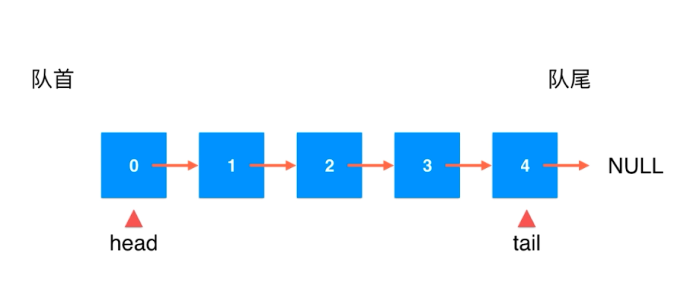

### 链表（单向链表）

- 动态数组
- 栈
- 队列

        - 底层依托的静态数组，靠resize解决静态数组固定容量的问题

- 链表  
   - 真正的动态数据结构
   - 最简单的动态数据结构
   - 更深入的理解引用（指针）
   - 跟家深入的理解递归
   - 辅助组成其他数据结构
   
### Linked List
- 数据粗存在“节点”(Node)中
- 
- 优点:真正的动态，不需要处理固定容量问题
- 缺点：丧失了随机访问的能力

### 数组和链表对比
- 数组
    - 数组最好处理索引有语意的情况
    - 最大的优点：支持快速查询
- 链表
    - 链表不适合用于索引有语意的情况
    - 最大优点：动态    
  
    
### 时间复杂度
- 添加元素
    - addLast(e)    O(n)
    - addFirst(e)   O(1)
    - add(index, e) O(n/2) = O(n)
- 删除操作
    - removeLast(e) O(n)
    - removeFirst(e)    O(1)
    - remove(index, e)  O(n/2) = O(n)
- 修改操作
    - set(index, e) O(n)
- 查找操作
    - get(index)    O(n)
    - contains(e)   O(n)
   
   
### 栈测试
- 当数据不多（50万左右）时，由于数组栈频繁的扩容/缩容，数组栈性能比不上链表栈
- 当数据量比较多时（大于100万左右）时，由于链表栈要频繁的new对象找空间，链表栈的性能比不上数组栈
- 两种栈的时间复杂度是一样的
--- 
    测试的数据量结果根据电脑的不同，会有出入，具体影响结果的数据量根据自己电脑测试为准。
---

### 队列
- TaoLinkedListQueue添加尾部指针
    - 队尾添加元素时间复杂度O(1)
    - 队首减少元素时间复杂度O(1)
    - 
    
### 双向链表
- 双向链表
    - 引用虚拟头部 + 尾部指针
- 双向循环链表
    - 引用虚拟头部
    