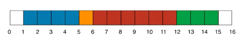

### 线段树

- 为什么要使用线段树
    - 有一面墙，长度为n，每次选择一段儿墙进行染色
        - ①：4-10 染黄色
        - ②：8-15 绿色
        - ③：1-5 蓝色
        - ④：6-12 棕色
        - 
        - m次操作后，我们可以看到多少中颜色
        - m次操作后，[i-j] 区间可以看到多少种颜色
   
    - 区间查询
        - 查询一个区间[i-j]的最大值、最小值、或者区间数字和等
  
   - 
    操作 | 时间复杂度（数组）| 使用线段树
    ---|---|---
    染色操作（更新区间）| O(n) | O(logn)
    查询操作（查询区间）| O(n) | O(logn)

