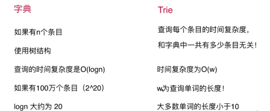
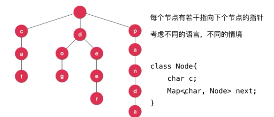

### Trie 字典树 前缀树
- 多叉树
- 只处理字符串
- 
- 

### 更多字符串问题
- 子串查询
    - KMP
    - Boyer-moor
    - Rabin-Karp
- 文件压缩
    - 哈夫曼算法
    - ……
- 模式匹配
    - 正则表达式
- 编译原理
- DNA

### leetcode
- 208 实现 Trie (前缀树)
    - https://leetcode-cn.com/problems/implement-trie-prefix-tree/description/
- 211 添加与搜索单词 - 数据结构设计
    - https://leetcode-cn.com/problems/add-and-search-word-data-structure-design/description/
- 677 键值映射
    - https://leetcode-cn.com/problems/map-sum-pairs/description/