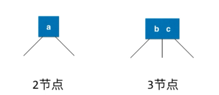
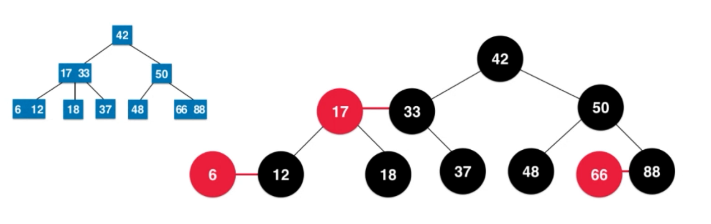

### 红黑树

- 算法导论中定义
    - 每个节点或者红色或者黑色
    - 根节点是黑色的
    - 没一个叶子节点（最后的空节点）是黑色的
    - 如果一个节点是红色的，那么他的孩子节点都是黑色的
    - 从任意一个节点到叶子节点，经过的黑色节点是一样的
- 算法4
    - 作者 Robert Sedgewick (红黑树发明人)
    - Donald Knuth 上述作者的老师（现代计算科学的先驱）
        - 《计算机编程艺术》
    - 红黑树与2-3树的等价性
    - 2-3树
        - 满足二分搜索树的基本性质
        - 不是二叉树
        - 节点可以存放一个元素或者两个元素
        - 
        - 2-3树是一颗绝对平衡的树
 - 保持黑平衡的二叉树     
 - 不是平衡二叉树  
 