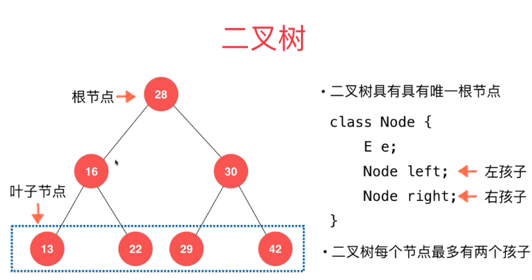
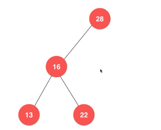
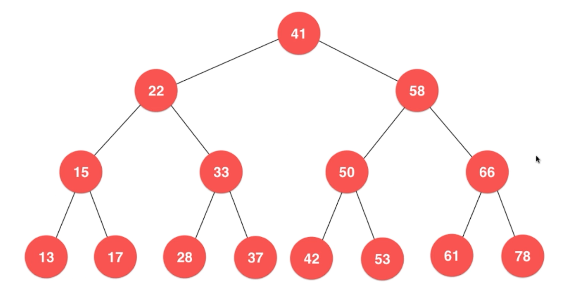

### 二叉树
- 和链表一样，动态数据结构
- 
- 具有且只有一个根节点
- 最多有两个孩子（左孩子，右孩子）
- 叶子节点：左右两个孩子都为空
- 每个节点最多只能有一个父亲节点（根节点没有父亲节点）
- 具有天然的递归结构
    - 每一个节点的左子树也是二叉树
    - 每一个节点的右子树也是二叉树
- 二叉树不一定是满的
    - 


### 二分搜索树
- 二分搜索树是二叉树
- 二分搜索树的每个节点的值：
    - 大于其左子树的所有节点的值
    - 小于其右子树的所有节点的值
- 每一颗子树也是二分搜索树
- 
- 储存的元素必须有可比较性

```
二分搜索树如果想包含重复元素的话，只需重新定义：左子树小于等于节点或者右子树大于等于节点
```

---
### 遍历
- 优先遍历
    - 前序遍历
    - 中序遍历
        - 二分搜索树中序遍历结果是顺序的
    - 后续遍历
        - 应用：为二分搜索树释放内存
- 广度优先遍历
    - 层序遍历
    - 意义
        - 更快的找到问题的解
        - 常用于算法的设计中-最短路径
        - 图中的深度优先遍历和广度优先遍历
        
### 删除任意元素
- Hibbard Deletion
    - 用待删除元素的左子树的最大值顶替
    - 用待删除元素的右子树的最小值顶替
    
#### leetco 530号问题
- https://leetcode-cn.com/problems/minimum-absolute-difference-in-bst/description/
- 给定一个所有节点为非负值的二叉搜索树，求树中任意两节点的差的绝对值的最小值。
    - 利用中序遍历结果有序的特点，把结果值放在LinkedList中，只需对相邻元素相减取最小值即可
    - Demo中的解决方法不是本题的最优解，只是一种解决思路

