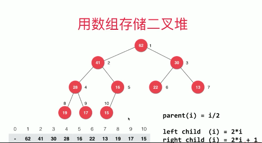
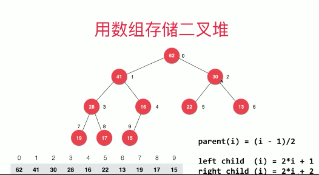

### 优先队列

结构 | 入队 | 出队（拿出最大元素）
---|---|---
普通线性结构 | O(1) | O(n)
顺序线性结构 | O(n) | O(1)
堆 | O(logn) | O(logn)

---

### 堆 
#### 二叉堆：
- 二叉堆是一颗完全二叉树
    - 把元素顺序排列成树的形状
- 任意节点的值都小于等于父节点的值
    - 根节点是最大的元素
    - 最大堆
- 数组存储二叉堆
    - 数组0索引空时：
    - 
    - 数组0索引存最大值时：
    - 

- Sift Up
- Sift Down

- Heapify
    - 将任意数组整理成堆的形状
        - 1、看做完全二叉树
        - 2、找到最后一个非叶子节点开始倒着往前sift down
        - 最后一个非叶子节点的索引： 
            - 0开始： (index - 1)/2
            - 1开始： index / 2
    - 算法复杂度：O(n)
    
            
- replace
    - 取出最大元素之后，放入一个新元素
    - 元素总数不变
    - 先extracMax，再add，两次O(logn)的操作
    - 直接将堆
    
### leetcode
- 347 前K个高频元素 
- https://leetcode-cn.com/problems/top-k-frequent-elements/description/  
 
---
    
### d 叉堆 d-ary heap
### 索引堆
### 二项堆
### 斐波那契堆

---
### 广义队列
- 支持入队、出队操作
- 栈、也可以理解是一个队列
    - 二分搜索树的非递归遍历
        - 前序遍历
        - 层序遍历
- 随机队列

