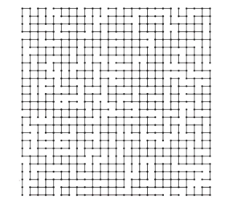

### 并查集
- 连接问题
    - 下图中任意两点否相连
        - 
    - 网络中节点间的连接状态
        - 网络是个抽象的概念：用户之间形成的网络
    - 数学中集合类实现
   
- 连接问题和路径问题
    - 比路径问题要回答的问题少
    - 和堆做比较
    
- 对于一组数据，主要支持两个动作
    - union(q,p)
        - 并，将两个数据合并/连接两个元素
    - isConnected(p,q)
        - 查询是否数据同一个集合/是否相连
        
### Quick Find
- Class TaoUnionFind1
    - 基于数组实现
- unionElements( p , q )    -->    O(n)
- isConnected( p , q )  --> O(1)

### Quick Union
- 将每一个元素都看做一个节点
- Class TaoUnionFind2
    - 基于数组实现
- unionElements( p , q )    -->    O(h)
- isConnected( p , q )  --> O(h)

- 基于size优化
- 基于rank的优化
- 路径压缩

